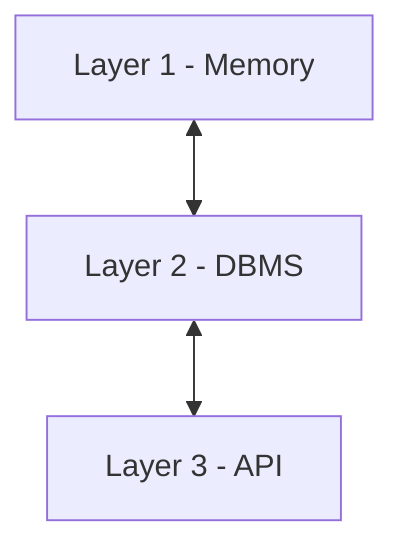

# Architecture

- [Architecture](#architecture)
  - [Overview](#overview)

## Overview

The project architecture is designed among 3 main layers, described in this document:

```mermaid
flowchart TD
    A[Layer 1 - Memory] <--> B[Layer 2 - DBMS]
    B <--> C[Layer 3 - API]
    C
```
