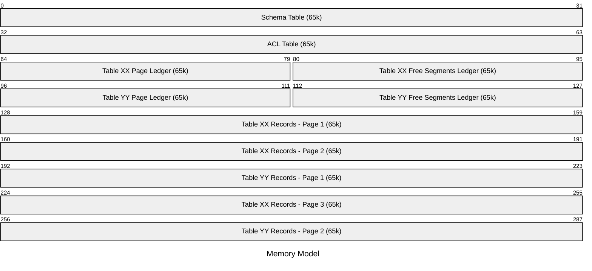

# Memory Management

- [Memory Management](#memory-management)
  - [How Internet Computer Memory Works](#how-internet-computer-memory-works)
  - [Memory Model](#memory-model)
  - [Memory Provider](#memory-provider)
  - [Memory Manager](#memory-manager)
  - [Encode](#encode)
  - [Schema Registry](#schema-registry)
  - [ACL](#acl)
  - [Table Registry](#table-registry)
    - [Page Ledger](#page-ledger)
    - [Free Segments Ledger](#free-segments-ledger)
    - [Index Registry](#index-registry)

This document provides the technical details of memory management in ic-dbms-canister, also known as Layer 0 of ic-dbms.

## How Internet Computer Memory Works

On the Internet Computer, canisters have access to a stable memory that persists across upgrades. This stable memory is divided into pages, each of which is 64 KiB in size.

When a canister is first created, it starts with a small amount of stable memory, and it can grow this memory as needed by allocating additional pages. The canister can read from and write to this stable memory using specific APIs provided by the Internet Computer SDK.

## Memory Model



## Memory Provider

Memory Provider trait defines the interface for interacting with the underlying memory.

It is mainly required because in tests we cannot use the actual stable memory of the IC,
so we need to provide a heap-based implementation for testing purposes.

```rust
pub trait MemoryProvider {
    /// The size of a memory page in bytes.
    const PAGE_SIZE: u64;

    /// Gets the current size of the memory in bytes.
    fn size(&self) -> u64;

    /// Gets the amount of pages currently allocated.
    fn pages(&self) -> u64;

    /// Attempts to grow the memory by `new_pages` (added pages).
    ///
    /// Returns an error if it wasn't possible. Otherwise, returns the previous size that was reserved.
    ///
    /// Actual reserved size after the growth will be `previous_size + (new_pages * PAGE_SIZE)`.
    fn grow(&mut self, new_pages: u64) -> MemoryResult<u64>;

    /// Reads data from memory starting at `offset` into the provided buffer `buf`.
    ///
    /// Returns an error if `offset + buf.len()` exceeds the current memory size.
    fn read(&self, offset: u64, buf: &mut [u8]) -> MemoryResult<()>;

    /// Writes data from the provided buffer `buf` into memory starting at `offset`.
    ///
    /// Returns an error if `offset + buf.len()` exceeds the current memory size.
    fn write(&mut self, offset: u64, buf: &[u8]) -> MemoryResult<()>;
}
```

We'll then have two implementations of this trait, the `IcMemoryProvider` that uses the IC stable memory,

```rust
pub struct IcMemoryProvider;

#[cfg(target_family = "wasm")]
impl MemoryProvider for IcMemoryProvider {
    const PAGE_SIZE: u64 = ic_cdk::stable::WASM_PAGE_SIZE_IN_BYTES;

    fn grow(&mut self, new_pages: u64) -> MemoryResult<u64> {
        ic_cdk::stable::stable_grow(new_pages).map_err(MemoryError::StableMemoryError)
    }

    fn size(&self) -> u64 {
        self.pages() * Self::PAGE_SIZE
    }

    fn pages(&self) -> u64 {
        ic_cdk::stable::stable_size()
    }

    fn read(&self, offset: u64, buf: &mut [u8]) -> MemoryResult<()> {
        // check if the read is within bounds
        if offset + buf.len() as u64 > self.size() {
            return Err(MemoryError::OutOfBounds);
        }

        ic_cdk::stable::stable_read(offset, buf);
        Ok(())
    }

    fn write(&mut self, offset: u64, buf: &[u8]) -> MemoryResult<()> {
        // check if the write is within bounds
        if offset + buf.len() as u64 > self.size() {
            return Err(MemoryError::OutOfBounds);
        }

        ic_cdk::stable::stable_write(offset, buf);
        Ok(())
    }
}
```

And another which just uses a vector as the backing store for testing purposes.

```rust
pub struct HeapMemoryProvider {
    memory: Vec<u8>,
}
```

## Memory Manager

Once we have the memory provider, we can build the memory manager on top of it.

The memory manager is responsible for allocating and deallocating memory segments, and it's globally available to the rest of the system.

```rust
/// The memory manager is the main struct responsible for handling the stable memory operations.
pub struct MemoryManager<P>
where
    P: MemoryProvider,
{
    provider: P,
}

// instantiate a static memory manager with the stable memory provider
thread_local! {
    #[cfg(target_family = "wasm")]
    pub static MEMORY_MANAGER: RefCell<MemoryManager<provider::IcMemoryProvider>> = RefCell::new(MemoryManager::init(
        provider::IcMemoryProvider::default(),
    ));

    #[cfg(not(target_family = "wasm"))]
    pub static MEMORY_MANAGER: RefCell<MemoryManager<provider::HeapMemoryProvider>> = RefCell::new(MemoryManager::init(
        provider::HeapMemoryProvider::default()
    ));
}

impl<P> MemoryManager<P>
where
    P: MemoryProvider,
{
    /// Initializes the memory manager and allocates the header and reserved pages.
    ///
    /// Panics if the memory provider fails to initialize.
    fn init(provider: P) -> Self;

    /// Returns the size of a memory page.
    pub const fn page_size(&self) -> u64;

    /// Returns the ACL page number.
    pub const fn acl_page(&self) -> Page;

    /// Returns the schema page.
    pub const fn schema_page(&self) -> Page;

    /// Allocates an additional page in memory.
    ///
    /// In case of success returns the [`Page`] number.
    pub fn allocate_page(&mut self) -> MemoryResult<Page>;

    /// Read data as a [`Encode`] impl at the specified page and offset.
    pub fn read_at<D>(&self, page: Page, offset: PageOffset) -> MemoryResult<D>
    where
        D: Encode;

    /// Write data as a [`Encode`] impl at the specified page and offset.
    pub fn write_at<E>(&mut self, page: Page, offset: PageOffset, data: &E) -> MemoryResult<()>
    where
        E: Encode;
}
```

## Encode

Before talking about each specific memory structure, it's important to understand how data is encoded and decoded in memory.

Every data structure that needs to be stored in memory must implement the `Encode` trait, which provides methods for serializing and deserializing data.

```rust
/// This trait defines the encoding and decoding behaviour for data types used in the DBMS canister.
pub trait Encode {
    const SIZE: DataSize;

    /// Encodes the data type into a vector of bytes.
    fn encode(&'_ self) -> Cow<'_, [u8]>;

    /// Decodes the data type from a slice of bytes.
    fn decode(data: Cow<[u8]>) -> MemoryResult<Self>
    where
        Self: Sized;

    /// Returns the size in bytes of the encoded data type.
    fn size(&self) -> MSize;
}

/// Represents the size of data types used in the DBMS canister.
#[derive(Debug, Clone, Copy, PartialEq, Eq)]
pub enum DataSize {
    /// A fixed size in bytes.
    Fixed(MSize),
    /// A variable size.
    Variable,
}

impl DataSize {
    /// Returns the size in bytes if the data size is fixed.
    pub fn get_fixed_size(&self) -> Option<MSize> {
        match self {
            DataSize::Fixed(size) => Some(*size),
            DataSize::Variable => None,
        }
    }
}
```

## Schema Registry

A very important part of the memory management is the schema table, where we store the pointers to each table registry page.

```rust
/// Data regarding the table registry page.
#[derive(Debug, Clone, Copy, PartialEq, Eq)]
pub struct TableRegistryPage {
    pub pages_list_page: Page,
    pub free_segments_page: Page,
}

/// The schema registry takes care of storing and retrieving table schemas from memory.
#[derive(Debug, Clone, PartialEq, Eq)]
pub struct SchemaRegistry {
    tables: HashMap<TableFingerprint, TableRegistryPage>,
}
```

The `SchemaRegistry` struct which holds a map of table fingerprints to their corresponding registry pages. The `TableRegistryPage` struct contains information about the pages used for storing the list of pages and free segments for each table.

The `SchemaRegistry` index the tables by a `TableFingerprint`, which is a unique identifier for each table schema.

## ACL

The Access Control List (ACL) is responsible for managing the principals that are allowed to access the database.

```rust
thread_local! {
    /// The global ACL.
    ///
    /// We allow failing because on first initialization the ACL might not be present yet.
    pub static ACL: RefCell<AccessControlList> = RefCell::new(AccessControlList::load().unwrap_or_default());
}

/// Access control list module.
///
/// Takes care of storing and retrieving the list of principals that have access to the database.
#[derive(Clone, Debug, Default, PartialEq, Eq)]
pub struct AccessControlList {
    allowed: Vec<Principal>,
}
```

And the ACL API allows to add, remove and check principals:

```rust
impl AccessControlList {
    /// Load [`AccessControlList`] from memory.
    pub fn load() -> MemoryResult<Self> {
        // read memory location from MEMORY_MANAGER
        MEMORY_MANAGER.with_borrow(|m| m.read_at(m.acl_page(), 0))
    }

    /// Get the list of allowed principals.
    pub fn allowed_principals(&self) -> &[Principal];

    /// Get whether a principal is allowed.
    pub fn is_allowed(&self, principal: &Principal) -> bool;

    /// Add a principal to the allowed list.
    ///
    /// If the principal is already present, do nothing.
    /// Otherwise, add the principal and write the updated ACL to memory.
    pub fn add_principal(&mut self, principal: Principal) -> MemoryResult<()>;

    /// Remove a principal from the allowed list.
    ///
    /// If the principal is not present, do nothing.
    /// Otherwise, remove the principal and write the updated ACL to memory.
    pub fn remove_principal(&mut self, principal: &Principal) -> MemoryResult<()>;

    /// Write [`AccessControlList`] to memory.
    fn write(&self) -> MemoryResult<()> {
        // write to memory location from MEMORY_MANAGER
        MEMORY_MANAGER.with_borrow_mut(|m| m.write_at(m.acl_page(), 0, self))
    }
}
```

## Table Registry

The table registry is responsible for managing the records of each table, utilizing the `FreeSegmentsLedger` and `PageLedger` to determine where to read and write data.

```rust
/// The table registry takes care of storing the records for each table,
/// using the [`FreeSegmentsLedger`] and [`PageLedger`] to derive exactly where to read/write
pub struct TableRegistry<E>
where
    E: Encode,
{
    _marker: PhantomData<E>,
    free_segments_ledger: FreeSegmentsLedger,
    page_ledger: PageLedger,
}
```

### Page Ledger

The page ledger is defined as follows:

```rust
/// Takes care of storing the pages for each table
#[derive(Debug)]
pub struct PageLedger {
    /// The page where the ledger is stored in memory.
    ledger_page: Page,
    /// The pages table.
    pages: PageTable,
}

impl PageLedger {
    /// Load the page ledger from memory at the given [`Page`].
    pub fn load(page: Page) -> MemoryResult<Self> {
        Ok(Self {
            pages: MEMORY_MANAGER.with_borrow(|mm| mm.read_at(page, 0))?,
            ledger_page: page,
        })
    }
}
```

And there are two functions to get the page for writing the provided record, and to commit the allocation after writing:

```rust
/// Get the page number to store the next record.
///
/// It usually returns the first page with enough free space.
/// If the provided record is larger than any page's free space,
/// it allocates a new page and returns it.
pub fn get_page_for_record<R>(&mut self, record: &R) -> MemoryResult<Page>
    where
        R: Encode;

/// Commits the allocation of a record in the given page.
///
/// This will commit the eventual allocated page
/// and decrease the free space available in the page and write the updated ledger to memory.
pub fn commit<R>(&mut self, page: Page, record: &R) -> MemoryResult<()>
where
    R: Encode;
```

### Free Segments Ledger

```rust
/// The free segments ledger keeps track of free segments in the [`FreeSegmentsTable`] registry.
///
/// Free segments can occur either when a record is deleted or
/// when a record is moved to a different location due to resizing after an update.
///
/// Each record tracks:
///
/// - The page number where the record was located
/// - The offset within that page
/// - The size of the free segment
///
/// The responsibilities of this ledger include:
///
/// - Storing metadata about free segments whenever a record is deleted or moved
/// - Find a suitable location for new records by reusing space from free segments
pub struct FreeSegmentsLedger {
    /// The page where the free segments ledger is stored in memory.
    free_segments_page: Page,
    /// Free segments table that holds metadata about free segments.
    table: FreeSegmentsTable,
}

impl FreeSegmentsTable {
    /// Inserts a new [`FreeSegment`] into the table.
    pub fn insert_free_segment(&mut self, page: Page, offset: usize, size: usize);

    /// Finds a free segment that matches the given predicate.
    pub fn find<F>(&self, predicate: F) -> Option<FreeSegment>
    where
        F: Fn(&&FreeSegment) -> bool;

    /// Removes a free segment that matches the given parameters.
    ///
    /// If `used_size` is less than `size`, the old record is removed, but a new record is added
    /// for the remaining free space.
    pub fn remove(&mut self, page: Page, offset: PageOffset, size: MSize, used_size: MSize);
}
```

The `FreeSegmentsTable` must both allow to insert new free segments to reuse space, but it must also optimize space reuse when removing segments.

This means that whenever we remove a free segment because we want to reuse its space, if the used size is less than the total size of the free segment, we must add a new free segment for the remaining free space.

```rust
impl FreeSegmentsTable {
    /// Removes a free segment that matches the given parameters.
    ///
    /// If `used_size` is less than `size`, the old record is removed, but a new record is added
    /// for the remaining free space.
    pub fn remove(&mut self, page: Page, offset: PageOffset, size: MSize, used_size: MSize) {
        if let Some(pos) = self
            .records
            .iter()
            .position(|r| r.page == page && r.offset == offset && r.size == size)
        {
            self.records.swap_remove(pos);

            // If there is remaining space, add a new record for it.
            if used_size < size {
                let remaining_size = size.saturating_sub(used_size);
                let new_offset = offset.saturating_add(used_size);
                let new_record = DeletedRecord {
                    page,
                    offset: new_offset,
                    size: remaining_size,
                };
                self.records.push(new_record);
            }
        }
    }
}
```

### Index Registry

RFU.
